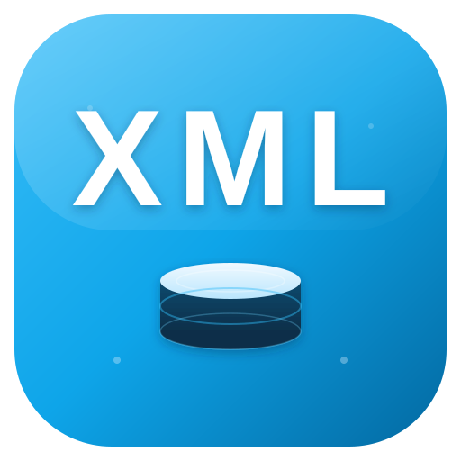
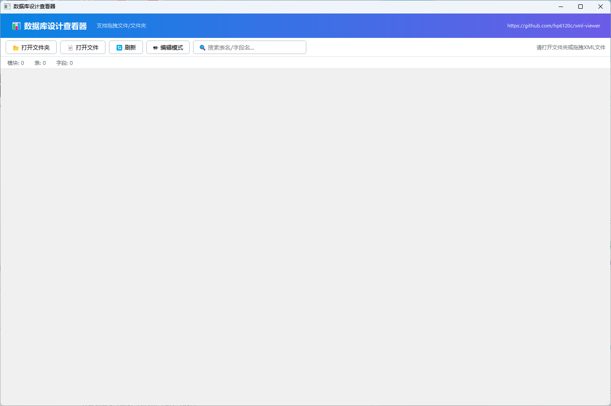

<p align="center">
  
</p>

<h1 align="center">XML 数据库设计查看器</h1>

<p align="center">
  一个基于 PyQt5 开发的桌面应用程序，用于方便地浏览和编辑 SCL Schema 格式的 XML 数据库设计文件。<br>
  支持多标签页、拖拽导入、编辑模式、搜索过滤和会话记忆等功能。
</p>

## 功能特性

| 功能 | 说明 |
|------|------|
| **多标签页浏览** | 每个 XML 文件独立一个标签页，支持同时查看多个文件 |
| **标签页管理** | 右键菜单支持关闭右侧、关闭其他、关闭所有标签页 |
| **树形导航** | 左侧按模块 → 子模块 → 表 的层级结构展示，点击直接跳转 |
| **表目录概览** | 右侧 HTML 渲染的表目录，包含表名、中文名、字段数、类型等信息 |
| **字段详情** | 点击表名查看完整字段列表，包含主键、类型、非空、默认值等 |
| **搜索过滤** | 支持按表名/字段名实时搜索过滤 |
| **拖拽导入** | 直接拖拽 XML 文件或文件夹到窗口即可打开 |
| **编辑模式** | 可切换到编辑模式直接修改当前选中表的 XML，支持多表切换编辑 |
| **会话记忆** | 关闭时自动保存打开的文件列表和窗口位置，下次启动自动恢复 |
| **自动更新** | 启动时自动检测新版本，支持一键下载更新并重启 |
| **版本显示** | 窗口标题和标题栏显示当前版本号 |

## 界面预览



## 环境要求

- **Python**: 3.8 或更高版本
- **操作系统**: Windows 10/11
- **依赖**: PyQt5

## 快速开始

### 方式一：直接运行 EXE（推荐）

从 [Releases](https://github.com/hp6120c/xml-viewer/releases) 下载最新版本的 `XMLDatabaseViewer-Vx.x.exe`，双击运行即可。

### 方式二：从源码运行

```bash
# 1. 克隆仓库
git clone https://github.com/hp6120c/xml-viewer.git
cd xml-viewer

# 2. 创建虚拟环境
python -m venv .venv
.venv\Scripts\activate

# 3. 安装依赖
pip install -r requirements.txt

# 4. 运行程序
python main.py
```

## 使用说明

### 打开文件

1. **菜单方式**: 点击工具栏的 "📂 打开文件夹" 按钮，选择包含 XML 文件的文件夹
2. **拖拽方式**: 直接拖拽 XML 文件或文件夹到窗口

### 浏览表结构

1. 左侧树形导航按 `模块 → 子模块 → 表` 层级组织
2. 点击任意表名，右侧显示该表的完整字段详情
3. 点击 "← 返回目录" 链接返回表目录概览

### 编辑 XML

1. 先点击左侧要编辑的表名
2. 点击工具栏的 "✏️ 编辑模式" 按钮，编辑器显示该表的 XML 内容
3. 在编辑模式下点击左侧其他表，编辑器自动切换到对应表的 XML
4. 修改完成后点击 "👁️ 阅读模式" 保存并刷新显示

### 标签页管理

在标签栏上 **右键** 可以：

- **关闭右侧标签页**: 关闭当前标签页右边的所有标签页
- **关闭其他标签页**: 关闭除当前外的所有标签页
- **关闭所有标签页**: 关闭全部标签页

## 项目结构

```
xml_viewer/
├── main.py              # 程序入口
├── version.txt          # 版本号
├── build.py             # 打包脚本
├── requirements.txt     # Python 依赖
├── .gitignore           # Git 忽略规则
├── .github/workflows/
│   └── build.yml        # CI/CD 自动打包
├── docs/
│   ├── logo.svg         # 应用 Logo
│   └── preview-main.png # 界面预览
├── ui/
│   ├── __init__.py
│   └── main_window.py   # 主窗口界面
└── utils/
    ├── __init__.py
    └── xml_parser.py    # XML 解析器
```

## 版本管理与自动发布

项目使用 GitHub Actions 实现自动打包和发布。

### 发布新版本

1. 修改 `version.txt` 中的版本号（如 `1.2`）
2. 推送到 GitHub：

```bash
git add version.txt
git commit -m "release: V1.2"
git push
```

GitHub Actions 会自动：
- 读取版本号
- 打包 EXE（文件名包含版本号）
- 创建 GitHub Release 并上传 EXE

### 本地打包

```bash
python build.py
```

打包后的 EXE 位于 `dist/` 目录，文件名自动包含版本号。

## 技术栈

- **GUI 框架**: PyQt5
- **XML 解析**: xml.etree.ElementTree
- **打包工具**: PyInstaller
- **CI/CD**: GitHub Actions
- **Python 版本**: 3.8+

## 常见问题

### Q: 启动时提示 "No module named 'PyQt5'"
确保已安装依赖：
```bash
pip install PyQt5
```

### Q: 打包后 exe 无法运行
尝试添加 `--hidden-import` 参数：
```bash
pyinstaller --hidden-import PyQt5.sip --hidden-import PyQt5.QtWidgets main.py
```

### Q: 中文显示乱码
程序默认使用 "微软雅黑" 字体，确保系统已安装该字体。

## License

MIT License
